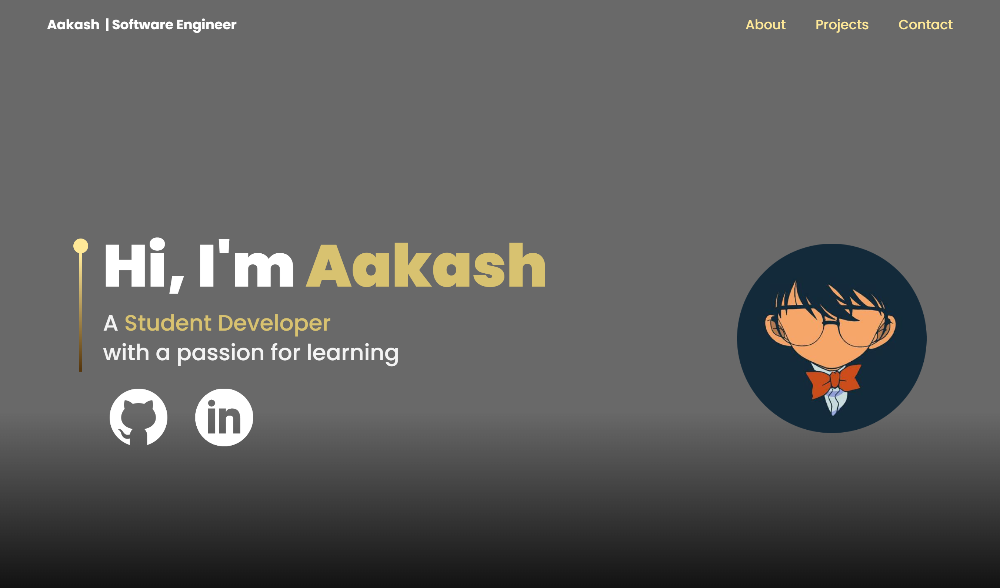

# Portfolio-website
# <https://aakash-portfolio-one.vercel.app/>

## Description
This website serves as a showcase of my work, skills, and projects. The site was built entirely using the React.js framework You can visit the live website using the link at the top.

### Features
* Built using React.js, Vite and Node.js
* Animation and effect are done using Framer Motion and Three.js
* CSS done with TailwindCSS

## License
This project is NOT licensed. [Learn more](LICENSE).

## Acknowledgments
This project was made possible with significant guidance from the excellent YouTube tutorial by 'JavaScript Mastery'. The video provides valuable insights and guidance that contributed significantly to the development of this project. <https://www.youtube.com/watch?v=0fYi8SGA20k>

Thank you for checking out my site!
